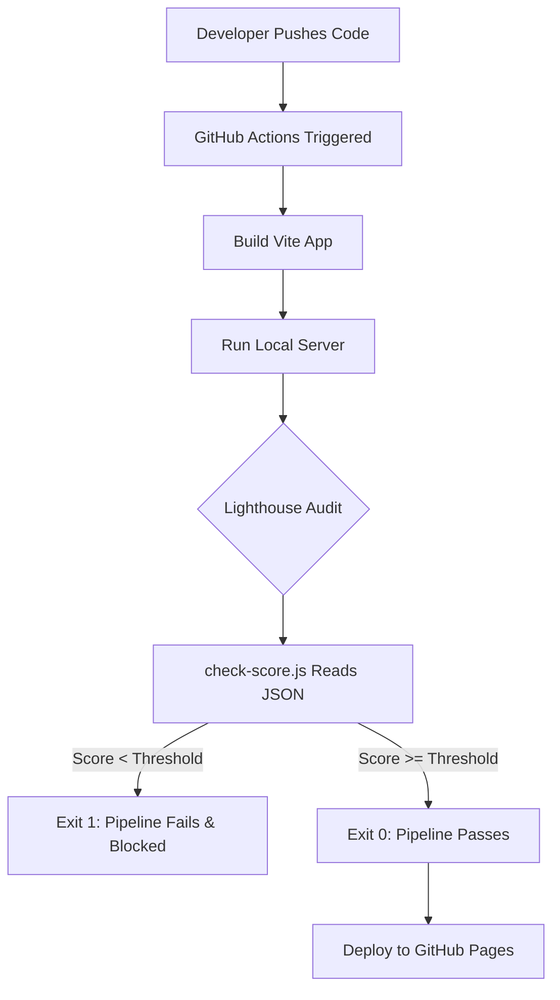

# Architecture: Performance-Gated CI/CD Pipeline

This document explains the architecture and design decisions behind the "Performance as Code" pipeline.

## Overview
The goal of this project is to block bad code from reaching production by implementing a **Performance Gate** in the CI/CD pipeline. Instead of just checking if the code compiles ("Does it deploy?"), it checks if the code is fast enough ("Is it fast enough to deploy?").

## Components

1. **The Demo App**: A Vite React application. For demonstration purposes, it contains intentionally unoptimized components (e.g., synchronous main-thread blocking, massive images) to simulate poor performance.
2. **Lighthouse CLI**: The engine for performance testing. It runs a headless audit against the built, locally-served version of the app.
3. **The Gate (`check-score.js`)**: A custom Node.js script. It acts as the brain of the operation, parsing the `lh-report.report.json` generated by Lighthouse. 
   - If the score is `< 80` (or `PERF_THRESHOLD`), it exits with code `1`, breaking the pipeline.
   - If the score is `>= 80`, it exits with code `0`, allowing the pipeline to proceed.
   - It also appends the historical score data to `public/scores.json`.
4. **GitHub Actions**: The CI/CD orchestrator. The workflow (`.github/workflows/deploy.yml`):
   - Builds the app.
   - Serves it locally (`vite preview`).
   - Runs the Lighthouse audit.
   - Runs the Gate script.
   - (Optional) Deploys to GitHub Pages if the gate passes.
5. **Score Dashboard**: A Chart.js visualization built directly into the React app that fetches `scores.json` and renders the performance history over time against the threshold.

## Workflow Execution Flow

## Environment Variables
- `PERF_THRESHOLD`: (Optional) Can be set in GitHub Variables. Defaults to `0.8` (80/100) if not specified.
